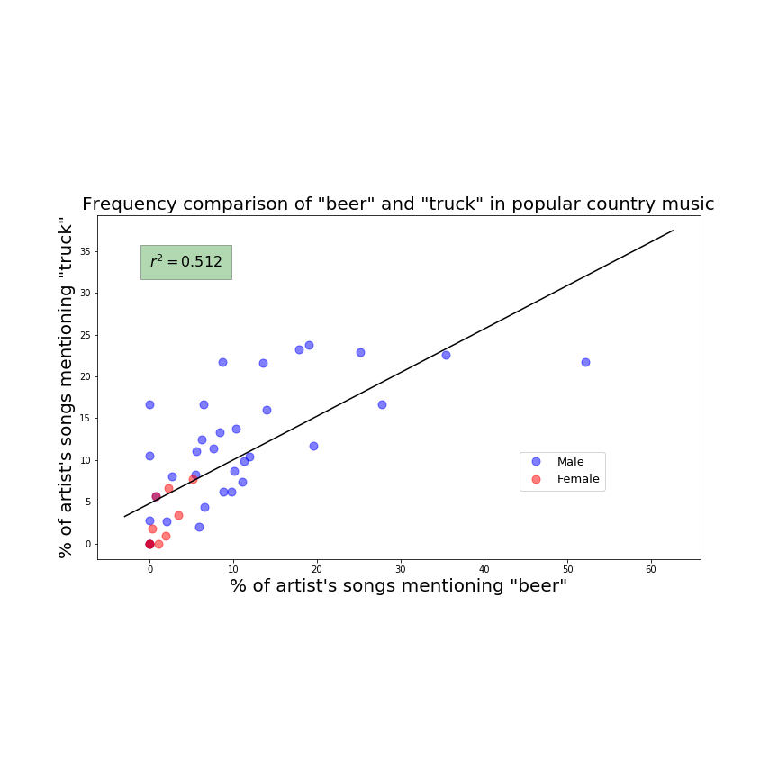

# song-lyrics-analysis

Inspired by a post on the [Big-ish Data Blog](https://bigishdata.com/2016/10/25/talkin-bout-trucks-beer-and-love-in-country-songs-analyzing-genius-lyrics/), I've started working on some textual analysis of contemporary country songs.

More specifically, I scraped [Billboard.com](https://www.billboard.com/charts/year-end/2017/top-country-artists) for a list of the top 50 country artists from 2017 and used my Genius API [python wrapper](https://github.com/johnwmillr/GeniusLyrics) to download the lyrics to each song by every artist on the list. After my script ran for about five hours, I was left with 5,089 songs across 50 artists stored in a 7 MB JSON file.

Some pertinent questions:
  - Which artist mentions trucks in their songs most often?
  - Does an artist's affinity for trucks predict any other features? Their gender for example? Or their fondness for dirt roads?
  - How does the mention of trucks vary with time? Each song item contains its publishing date.
  - Of the fifty artists, whose language is most unique? Whose is most generic?

Should be a fun project!

---
### Visualizations
Here's a preliminary plot to get the ball rolling...

Each point on the plot represents one of the top fifty country artists from Billboard's 2017 list. The values for each point were calculated as a simple percentage of times the given artist mentions a particular term. For example, Cole Swindell had 46 total songs and mentioned beer in 24 of them, arriving at a mention percentage of 52%. I've also added the artist's gender to the plot. Not enough women were represented in Billboard's Top 50 chart, so I'm currently downloading lyrics from additional female country artists. But even with this small sample size, there does appear to be an interaction between gender and one's likelihood to sing about trucks and beer...
