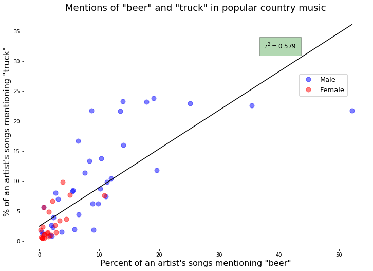

# Trucks and beer
I'm interested in whether an artist's tendency to use certain terms correlate together. For example, if an artist is more likely to mention beer in their songs, are they more likely to also mention trucks?

It turns out that yes, they are.

Check out [my blog post](http://www.johnwmillr.com/trucks-and-beer/) for more details.

